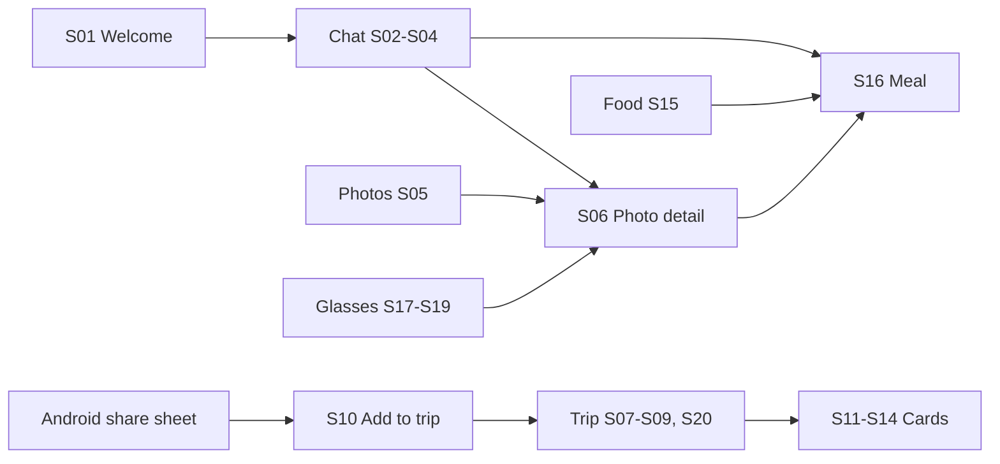
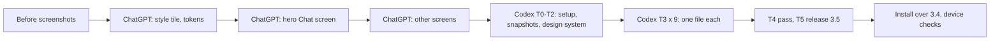

# Fieldnote 3.5 — screen redesign plan (ChatGPT designs, Codex builds)

Fieldnote gets a new look in four phases. **Phase 0:** get your Mac ready and capture the current screens.
**Phase 1:** design about 20 phone screens in ChatGPT Images, starting with one style tile and one hero screen that fix
the look. **Phase 2:** Codex on your Mac rebuilds each Compose screen to match, one file at a time. It renders every
screen to PNG so it can compare its work with the mockup before you review it. **Phase 3:** ship it as 3.5, installed
over 3.4 without losing your data.

Everything Codex needs is in this repo: `AGENTS.md` (its rules), `design/screens.md` (every screen, its states and
the ChatGPT prompt), `design/codex-tasks.md` (the prompts to paste into Codex, in order), `design/tokens.json` (the
colours and type).

## What we're designing

- **Fieldnote 3.4:** Android, Kotlin + Jetpack Compose, package `com.urmit.glasses.dev`. The source is in `fieldnote/` on
  branch `claude/meta-ai-glasses-cowork-4oegas`, imported from the Cowork build.
- **The glasses:** Ray-Ban Meta, which have no display. The glasses speak and listen, and the phone is the only screen.
  So every screen here is a phone screen: nothing is drawn for a heads-up display.
- **The job:** a visual redesign of the screens that exist today. The behaviour stays as it is. New features are
  out of scope until the unfinished "Fieldnote UI and UX plan" doc decides them (see the end of `design/codex-tasks.md`).
- **What changes visibly:** proper icons instead of emoji and Unicode glyphs (▣ ● ↑ ♥ 🗑 🎙 🔊 📍), clearer hierarchy on
  the long Trip and Glasses screens, one consistent card, chip and header system, and a stronger session state on
  the Glasses tab.

### Screens

| ID | Screen | Code | Image | First pass |
| --- | --- | --- | --- | --- |
| D00 | Style tile + tokens | `ui/Theme.kt` | `d00-style-tile.png` | yes |
| D01 | Icon sheet | `ui/icons/` (new) | `d01-icons.png` | yes |
| S03 | Chat, conversation (hero) | `ui/ChatScreen.kt` | `s03-chat.png` | yes |
| S02 | Chat, empty | `ui/ChatScreen.kt` | `s02-chat-empty.png` | |
| S04 | Chat list | `ui/ChatScreen.kt` | `s04-chats.png` | |
| S05 | Photos | `ui/GalleryScreen.kt` | `s05-photos.png` | yes |
| S06 | Photo detail | `ui/DetailScreen.kt` | `s06-photo-detail.png` | yes |
| S07 | Trip, empty | `ui/TripScreen.kt` | `s07-trip-empty.png` | |
| S08 | Trip, top (now, cards, offline pack) | `ui/TripScreen.kt` | `s08-trip.png` | yes |
| S09 | Trip, bookings, money, notes | `ui/TripScreen.kt` | `s09-trip-money.png` | |
| S10 | Add to trip (share sheet) | `ui/ImportScreen.kt` | `s10-add-to-trip.png` | |
| S11 | Driver card | `ui/CardScreen.kt` | `s11-card-driver.png` | yes |
| S12 | Allergy card | `ui/CardScreen.kt` | `s12-card-allergy.png` | |
| S13 | Phrases | `ui/CardScreen.kt` | `s13-card-phrases.png` | |
| S14 | Emergency card | `ui/CardScreen.kt` | `s14-card-emergency.png` | |
| S15 | Food | `ui/FoodScreen.kt` | `s15-food.png` | yes |
| S16 | Meal detail | `ui/FoodScreen.kt` | `s16-meal.png` | |
| S17 | Glasses, session | `ui/GlassesScreen.kt`, `ui/SessionScreen.kt` | `s17-glasses.png` | yes |
| S18 | Glasses, setup and tests | `ui/GlassesScreen.kt` | `s18-glasses-setup.png` | |
| S19 | Glasses, answers (key, models) | `ui/GlassesScreen.kt` | `s19-glasses-answers.png` | |
| S20 | Traveller profile | `ui/TripScreen.kt` | `s20-profile.png` | optional |
| S01 | Welcome | `MainActivity.kt` | `s01-welcome.png` | |
| D02 | App icon | `res/mipmap*`, `res/drawable/ic_fg.xml` | `d02-app-icon.png` | optional |

The screens marked "yes" cover every component type, so they're enough to start Codex on. The rest reuse those parts.
Each screen's section in `design/screens.md` lists the states Codex must build: loading, empty, error, busy and so on.
Most of those are described in words, not drawn.

How the screens connect today (the redesign keeps this):

The five tabs are Chat, Photos, Trip, Food and Glasses. The cards also open from a lock-screen notification, and from
voice commands such as "take me home".

## The pipeline

The mockups go into `design/mockups/`, which is where Codex reads them. Codex's renders come back to
`design/renders/`, so you can compare the two in Finder or on GitHub.

## Phase 0 — Before you start (1–2 hours, plus downloads)

1. **Make the repo private, or keep personal data out of it.** `urmit2595/my-first-repo` is public. The mockups
   and code are fine to publish, but screenshots of your real chats, photos, bookings and places are not. Either
   make the repo private (GitHub → Settings → Danger zone → Change visibility), or take the "before" screenshots with
   sample data only.
2. **Install on the Mac:** the Codex app, up to date (Appshots needs 26.519 or later) and signed in; Android Studio,
   which brings the JDK 17 and the Android SDK (add platform 35 and build-tools 35 in its SDK Manager); Git.
   Codex task T0 checks all of this and adds a Gradle wrapper.
3. **Find your Fieldnote keystore and its passwords.** They came with the Cowork build (`fieldnote.keystore`). Only
   an APK signed with the same key installs over the app on your phone and keeps your chats, meals, trips and
   settings. Without it you can still do all the design work, but only on an emulator.
4. **Put 3.4 on the phone first and run its checks.** 3.4 has never run on hardware (see `fieldnote/RELEASE-NOTES.md`,
   "Suggested first run"). If you restyle on top of an unchecked build and something breaks, you won't know whether
   the new look or 3.4's travel code broke it. After T0, ask Codex for `./gradlew assembleRelease`, then install it
   with `adb install -r <apk>`.
5. **Capture the current screens.** On the phone, screenshot every screen in the table (and its main states), then
   copy them to `design/before/` with the names in `design/before/README.md`. The Trip, card and import screens only
   exist from 3.4, which is another reason for step 4.

## Phase 1 — Design in ChatGPT (4–6 hours over one or two days)

Everything to paste is in `design/screens.md`. The order matters, because the first two images set the look for the
rest.

1. **Set up once.** Create a ChatGPT Project called `Fieldnote screens`. Paste the instructions block from
   `design/screens.md` §0 into it, and upload the before screenshots.
2. **Round 1, the visual system (D00).** Generate the style tile in three directions, each in its own chat:
   A "Evolved Fieldnote" (today's warm dark, orange accent, Bricolage Grotesque + IBM Plex), B "Field journal" (warm
   paper, readable in sun) and C "Instrument" (OLED black, dot-matrix numbers, one red). Pick one and refine it with
   image comments. Then ask for the token JSON and paste it into `design/tokens.json`. Draw the icon sheet (D01) in
   the same chat.
3. **Round 2, the hero (S03 Chat).** Iterate until you'd ship it. Upload it to the project files, since every later
   prompt attaches it.
4. **Round 3, everything else.** Do the first-pass screens first. Use one chat per group (Chat, Glasses, Photos,
   Trip, cards, Food) and attach the style tile, the hero and the before screenshot every time.
5. **Round 4, consistency.** Put all the approved PNGs side by side (Finder → Gallery view) and regenerate any that
   drift: a different header size, card style, icon weight or accent.
6. **Save and push.** Download each approved image at full size as PNG, named exactly as in the table, into
   `design/mockups/`. Commit and push, or ask Codex to.

How to judge a mockup:

- Everything its prompt lists is there, and nothing more. No invented buttons, badges or features.
- Same colours, type, radii and icon weight as the hero, and the tab bar is identical everywhere.
- Hierarchy reads at a glance: the one thing that matters on the screen is the most prominent thing.
- Taps look at least 48 dp. Text looks at least 12 sp.
- **Ignore typos and garbled text, including Japanese.** Codex takes the words from the code, not the image. Fix
  layout, not spelling.

Working tips:

- **Fix small things with image comments.** Click the spot and say "make this a ghost button". It's faster than a
  re-prompt, and Images 2.5 keeps the rest of the image stable across edits.
- **When words don't get the layout across, use Sketch.** Draw boxes where things go.
- **Long screens are split on purpose.** Trip is S08 and S09, Glasses is S17 to S19. One image can't show a long
  scroll legibly.
- **If you hit image limits,** spread the rounds over two days. The first-pass set (8 images plus the tile and icons)
  is enough to start Codex while you finish the rest.

## Phase 2 — Build with Codex (about 2 days of short sessions)

Paste the prompts from `design/codex-tasks.md`, one thread per task, in order:

| Task | What happens | Result |
| --- | --- | --- |
| T0 | Working branch `fieldnote-3.5-ui` (3.4 code + this plan), toolchain check, Gradle wrapper, first build | Builds on your Mac |
| T1 | Roborazzi snapshot tests, `PhoneFrame`, `SampleData.kt`, render the current components | Screens render to PNG without a phone |
| T2 | Tokens into `Theme.kt`, shared components restyled in `Components.kt`, Lucide icons, new tab bar | The design system, checked against D00 |
| T3 ×9 | One screen file per task: split into stateless content + previews for every state, restyle, render, compare with the mockup, fix | One commit per file |
| T4 | Contact sheet of every screen, consistency and accessibility fixes | Coherent app |

**Why screens are split before restyling.** Today each screen reads `AppState` directly, so it can only be seen on a
running phone with real data. Splitting it into a thin `XxxScreen` (state, callbacks: unchanged) and a stateless
`XxxContent` has two effects. Codex can render every state from sample data and compare it with the mockup by
itself. And the behaviour code is moved, not rewritten, which is what keeps 3.5 a pure visual change.

**Your review, per task (5–10 minutes):**

1. Open the renders in `design/renders/` next to the mockups. Is it close enough? If not, say what's wrong in plain
   words or attach the mockup with an image comment, and Codex goes another round.
2. Check that the diff only touches `ui/`, the UI parts of `MainActivity.kt`, resources or test setup. Anything in
   `data/`, `service/` or the manifest is a stop: ask why and have it reverted.
3. Optionally click through it on an emulator: Android Studio → Device Manager → a Pixel 7 profile (412 × 915 dp,
   the size the mockups use), Run. The glasses won't connect there, but every screen opens.
4. Say "commit". Push at the end of each session: `git push -u origin fieldnote-3.5-ui`.

**If Codex gets stuck:** Gradle can't write or download inside its sandbox (see `AGENTS.md` → Sandbox notes);
Roborazzi won't build with this setup (T1 names the fallback: emulator screenshots); or the mockup asks for
something the code can't show. In that last case the code wins; note it and move on.

## Phase 3 — Ship 3.5 and check it on the phone (about an hour)

T5 sets version 3.5 (350), writes the release notes and builds the signed APK. You install it with
`adb install -r <apk>` (the `-r` keeps your data). **Never uninstall.** Then check:

1. The app opens on Chat, and your chats, photos, meals, trips and settings are all there.
2. Every tab and every pushed screen opens. Nothing is clipped at your phone's font size.
3. Start a session. The ring moves through Ready, Photo, Thinking and Answering. The lock-screen notification still
   offers Photo, Ask and End.
4. Tap, double-tap and triple-tap on the glasses still do what they did (re-run Test A).
5. The driver, allergy, phrases and emergency cards are white, bright and readable at arm's length outdoors.
6. Share a booking email to Fieldnote. "Add to trip" opens and files it.
7. With TalkBack on, the icon buttons read out their names.

## Decisions, with the default this plan assumes

| Decision | Default | Alternatives | Decided in |
| --- | --- | --- | --- |
| Visual direction | A · Evolved Fieldnote | B · Field journal, C · Instrument | Phase 1, round 1 |
| Scope | Restyle the existing 3.4 screens | Also design the new features in the UI and UX plan doc | Now |
| Mockup format | Flat 412 × 915 dp screen, no device frame | Photoreal device renders (prettier, but harder for Codex to read) | Now |
| Icons | Lucide, as Compose `ImageVector`s (ISC licence) | Material Symbols | T2 |
| Snapshot tool | Roborazzi (JVM, no emulator) | Emulator + `adb screencap` | T1 |
| Where it runs | Signed 3.5, installed over 3.4 | Debug build on the emulator only | T5 |
| Repo visibility | Private, or sample-data screenshots only | Public with real screenshots (not advised) | Phase 0 |

## Risks and how the plan handles them

| Risk | What would happen | Handling |
| --- | --- | --- |
| Wrong signing key | 3.5 won't install over 3.4, and uninstalling wipes chats, meals and trips | T5 refuses to make a new key. `adb install -r` only, never uninstall. Keystore located in Phase 0 |
| Codex changes behaviour while restyling | Taps, sessions or travel actions break silently | `AGENTS.md`: UI-only files, logic moved verbatim, unit tests and build every task, you review each diff |
| Mockups drift apart | The app looks stitched together | Style tile + hero attached to every prompt, round-4 check, T4 contact sheet |
| AI text errors in images | Wrong words or broken Japanese in the build | Words always come from the code. `screens.md` says so, and so does `AGENTS.md` |
| Mockups invent features | Codex builds buttons that do nothing | The prompts forbid additions, and Codex ignores anything not in the spec |
| 3.4 bugs mistaken for UI bugs | Time lost chasing the wrong cause | Install and check 3.4 before the redesign (Phase 0, step 4) |
| Personal data in a public repo | Chats, bookings and locations published | Make the repo private, or use sample data (Phase 0, step 1) |
| Codex sandbox blocks Gradle | Builds fail inside Codex | `GRADLE_USER_HOME` in the repo, allow network, or run the first build in Terminal |

## Effort (rough estimates)

| Phase | Your time | Notes |
| --- | --- | --- |
| 0 · Setup and before screenshots | 1–2 h | Plus Android Studio download time |
| 1 · ChatGPT design | 4–6 h | About 23 images at 2–4 tries each. The first-pass set is about half of that |
| 2 · Codex build | About 2 days of short sessions | T0–T2 about half a day; each T3 30–60 min including your review |
| 3 · Release and device check | About 1 h | |

## Checklist

- [ ] Repo private, or before screenshots made with sample data
- [ ] Codex app, Android Studio (SDK 35) and Git on the Mac; keystore and passwords found
- [ ] T0 run: branch `fieldnote-3.5-ui`, wrapper added, 3.4 builds
- [ ] 3.4 installed over 3.3 and its first-run checks done
- [ ] Before screenshots in `design/before/`
- [ ] ChatGPT project set up; direction picked; `d00`, `d01` approved; `tokens.json` updated
- [ ] `s03` hero approved and uploaded to the project
- [ ] First-pass mockups approved and in `design/mockups/`: s05, s06, s08, s11, s15, s17
- [ ] T1 snapshots working; T2 design system committed
- [ ] T3 done for all 9 files (Chat, Glasses, Photos, Detail, Trip, Import, Cards, Food, Welcome)
- [ ] T4 contact sheet reviewed
- [ ] T5 3.5 built, installed with `-r`, device checks 1–7 pass
- [ ] Branch pushed; optional PR for review

## Sources

- [ChatGPT Images 2.5 (OpenAI, 8 September 2026)](https://openai.com/index/introducing-chatgpt-images-2-5/): multi-turn
  editing that keeps images consistent, reference images, Sketch, image comments, templates.
- [Appshots in Codex for Mac](https://pasqualepillitteri.it/en/news/3135/codex-appshots-command-command-mac): press
  Command twice to attach the front window (Codex 26.519, 21 May 2026).
- [Image input in the Codex CLI](https://inventivehq.com/knowledge-base/openai/how-to-use-image-input): `--image` / `-i`.
- Fieldnote facts (screens, tokens, build, keystore, 3.4 status): `fieldnote/README.md`, `fieldnote/RELEASE-NOTES.md`
  and `fieldnote/app/src/main/kotlin/com/urmit/glasses/dev/ui/*` on branch `claude/meta-ai-glasses-cowork-4oegas`.
